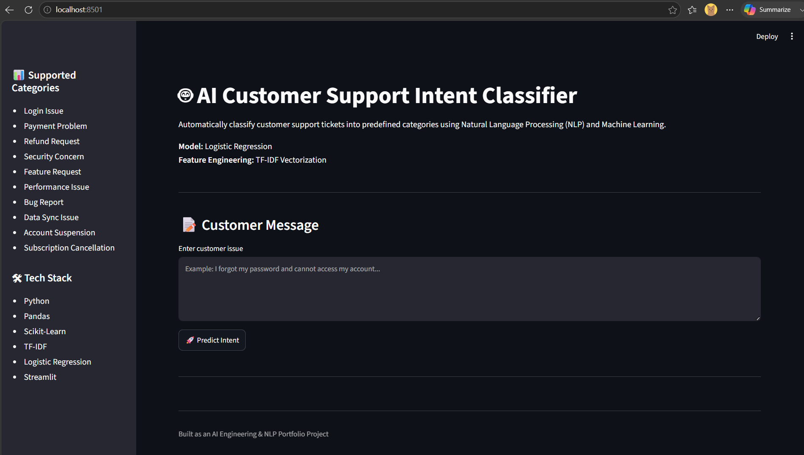
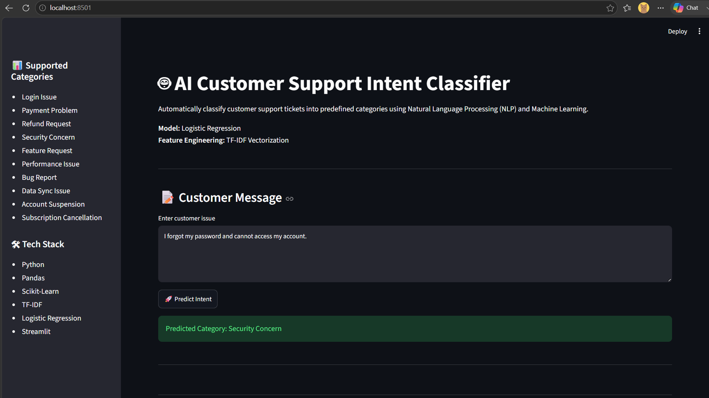
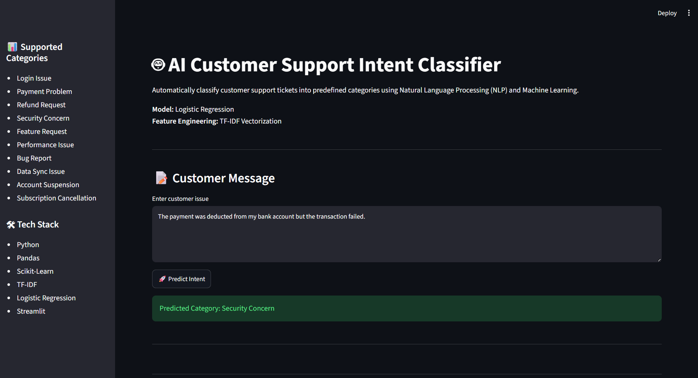
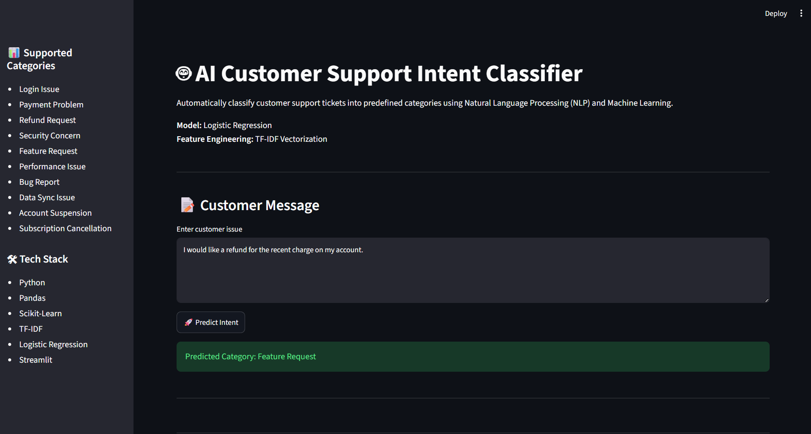
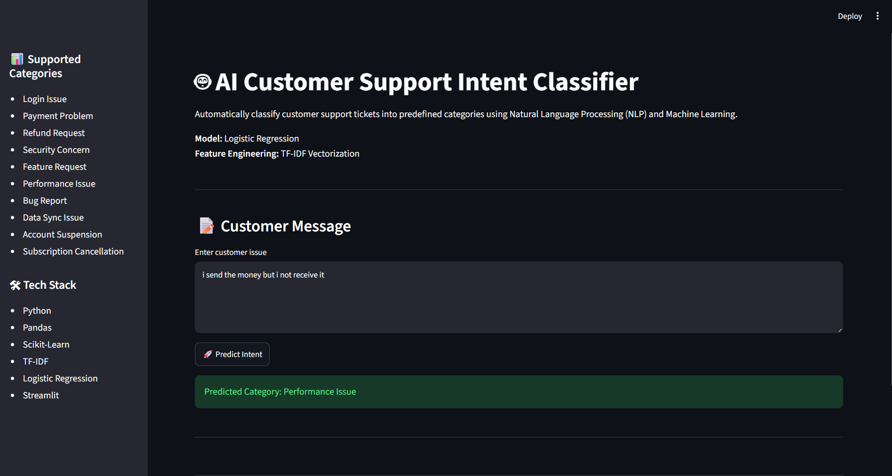

# 🤖 AI-Powered Customer Support Intent Classification System

Automatically classifies customer support tickets into predefined categories using Natural Language Processing (NLP) and Machine Learning.

---

## Problem Statement

Customer support teams receive thousands of tickets every day. Manually routing tickets to the correct department is time-consuming and error-prone.

This project uses Machine Learning to automatically classify customer support messages into categories such as:

* Login Issue
* Payment Problem
* Refund Request
* Security Concern
* Feature Request
* Performance Issue
* Bug Report
* Data Sync Issue
* Account Suspension
* Subscription Cancellation

---

## Project Architecture

```text
Customer Support Tickets
           │
           ▼
Data Cleaning
           │
           ▼
Text Preprocessing
           │
           ▼
TF-IDF Feature Engineering
           │
           ▼
Logistic Regression Model
           │
           ▼
Model Evaluation
           │
           ▼
Prediction System
           │
           ▼
Streamlit Web Application
```

---

## Application Screenshots

### Project Home Page



---

### User Input Interface



---

### Intent Classification Example



---

### Customer Support Ticket Prediction



---

### NLP Model Prediction Result



---

### Complete Streamlit Application


---

## Tech Stack

* Python
* Pandas
* NumPy
* Scikit-Learn
* TF-IDF Vectorization
* Logistic Regression
* Streamlit
* Git
* GitHub

---

## Project Structure

```text
AI-Customer-Support-Intent-Classifier/
│
├── data/
│   ├── raw/
│   └── processed/
│
├── notebooks/
│
├── src/
│   ├── preprocessing/
│   ├── features/
│   ├── training/
│   └── prediction/
│
├── models/
│   ├── intent_classifier.pkl
│   └── tfidf_vectorizer.pkl
│
├── app/
│   └── streamlit_app.py
│
├── assets/
│   └── screenshots/
│       ├── pg1.png
│       ├── pg2.png
│       ├── pg3.png
│       ├── pg4.png
│       ├── pg5.png
│       └── pg6.png
│
├── requirements.txt
├── README.md
├── .gitignore
└── LICENSE
```

---

## Machine Learning Pipeline

### Data Cleaning

* Selected relevant columns
* Removed missing values
* Prepared dataset for NLP processing

### Text Preprocessing

* Converted text to lowercase
* Removed punctuation
* Removed unnecessary whitespace

### Feature Engineering

Used TF-IDF Vectorization to transform text into numerical features that can be processed by machine learning algorithms.

### Model Training

* Train/Test Split
* Logistic Regression Classifier
* Model Evaluation

### Model Persistence

Saved trained artifacts for future predictions:

* intent_classifier.pkl
* tfidf_vectorizer.pkl

---

## Running the Project

### Install Dependencies

```bash
pip install -r requirements.txt
```

### Train the Model

```bash
python src/training/train_model.py
```

### Run Prediction Script

```bash
python src/prediction/predict.py
```

### Launch Streamlit App

```bash
python -m streamlit run app/streamlit_app.py
```

---

## Features

* End-to-End NLP Pipeline
* Text Cleaning & Preprocessing
* TF-IDF Feature Engineering
* Intent Classification
* Logistic Regression Model
* Model Persistence using Pickle
* Interactive Streamlit Dashboard
* Git & GitHub Version Control

---

## Key Learnings

* Natural Language Processing (NLP)
* Data Cleaning and Preparation
* Feature Engineering with TF-IDF
* Machine Learning Model Training
* Model Evaluation Techniques
* Model Serialization
* Streamlit Application Development
* Git & GitHub Workflow

---

## Future Improvements

* BERT-Based Intent Classification
* Deep Learning Models
* Confidence Score Display
* FastAPI Backend Integration
* Docker Containerization
* AWS Cloud Deployment
* Model Monitoring & Logging
* CI/CD Pipeline

---

## Author

**Rokith**

Aspiring AI Engineer & Data Engineer

Focused on Machine Learning, Natural Language Processing (NLP), Data Engineering, and Production AI Systems.
